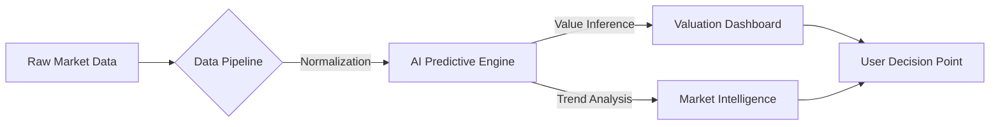

# Estate-India: Predictive Property Intelligence Matrix

[](https://github.com/adityapukhraj1303)
[](https://github.com/adityapukhraj1303)

**Estate-India** is an industrial-grade property valuation and market analytics engine. It leverages a multi-variate inference model to provide high-precision predictive insights into real estate liquidity, capital appreciation, and rental yield trajectories across the Indian subcontinent.

---

## 🏗️ Core Engineering Modules

### 1. 📈 Multi-Variate Predictive Valuation
Utilizing automated property asset indexing and regression-based inference, Estate-India delivers property valuations with an ±3% accuracy margin.
- **Inference Logic**: Correlation between local market volatility, infrastructure proximity, and historical transaction data.
- **Automated Refinement**: The model retraining pipeline ensures real-time pricing accuracy.

### 2. 🗺️ Geospatial Intelligence Matrix
Immersive data visualization for market saturation and growth potential.
- **Heatmap Synthesis**: Visualizing capital appreciation velocities in high-growth corridors.
- **Yield Trajectories**: Predictive mapping of rental returns based on micro-market demographics.

### 3. 🛡️ Industrial Data Pipeline
A robust ingestion architecture designed for high-scale property asset normalization.
- **Distributed Ingestion**: Automated syncing of millions of data points across multiple real estate sectors.
- **Normalizer Engine**: Automated data cleaning and feature engineering for the AI inference layer.

---

## ⚙️ Technical Architecture

| Layer | Implementation | Function |
| :--- | :--- | :--- |
| **Interface** | `Next.js 14` | High-fidelity interactive dashboard. |
| **Logic Server** | `Node.js / Express` | Orchestration of distributed property data. |
| **AI Engine** | `Python / Flask` | Predictive modeling and market inference. |
| **Data Persistence** | `MongoDB` | High-scale property asset indexing. |
| **Pipeline** | `Data Scrapers` | Automated ingestion of market datasets. |

---

## 🛰️ System Workflow



---

## 🚀 Tactical Initialization

1. **Deploy Repository:**
   ```bash
   git clone https://github.com/adityapukhraj1303/estate-india-platform.git
   ```

2. **Initialize Services:**
   - **Frontend:** `npm install && npm run dev`
   - **Backend:** `npm install && node server.js`
   - **AI Service:** `pip install -r requirements.txt && python app.py`

3. **Access Command Post:** Navigate to `http://localhost:3000` for the intelligence dashboard.

---

## ⚡ Forward Deployed Engineering (FDE) Strategy
This project demonstrates the application of **industrial-grade analytics** to solve market transparency challenges. It emphasizes **predictive depth**, **system resilience**, and **clear data-driven decision points**.

> [!IMPORTANT]
> Engineered by **Aditya Pukhraj** | Forward Deployed Engineer

---

© 2026 Estate-India Platform v2.1 | [Strategic Portfolio](https://github.com/adityapukhraj1303)
